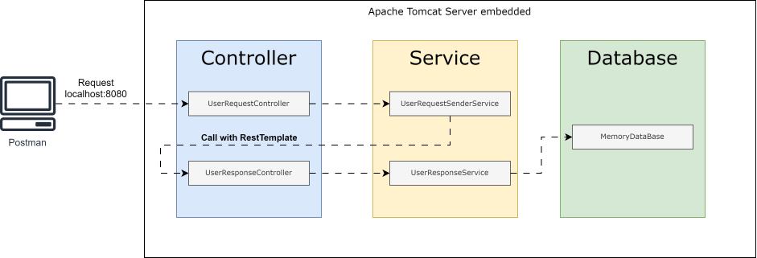
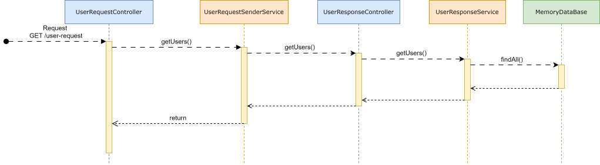

#  Using Rest-Template to call Rest API Service

<!-- TOC -->
* [Using Rest-Template to call Rest API Service](#using-rest-template-to-call-rest-api-service)
  * [Description](#description)
  * [General diagram](#general-diagram)
  * [Sequence diagram](#sequence-diagram)
  * [Postman Collection](#postman-collection)
  * [Dependencies](#dependencies)
  * [Package](#package)
<!-- TOC -->

## Description

Project using RestTemplate to call API Service. 

Extra: Using Exception Handler using @ControllerAdvice and @ExceptionHandler

* Language: Java 17
* Framework: SpringBoot 3
* Dependency management: Maven 3.6.3

 

## General diagram

## Sequence diagram

## Postman Collection

Click the link below to download the Postman collection:

[Download Postman Collection](docs/api-client-service-rest-template.postman_collection.json)

1. Download the file from the link above.
2. Open Postman.
3. Click "Import" in the top left corner.
4. Select the downloaded `api-client-service-rest-template.postman_collection.json` file.
5. You can now test the API endpoints using the provided examples.

## Dependencies

- spring-boot-starter-web
- lombok

- h2

## Package

- controllers: Used to define endpoints.
- service: Used to process logic bussines.
- repository: Used to connect with relational databases .
- proxy.client: Implements Classes to connect with other REST Services.
- config: Used to configure the project behaviour.
- model: Used to create simples object like POJOs, DTOs.
