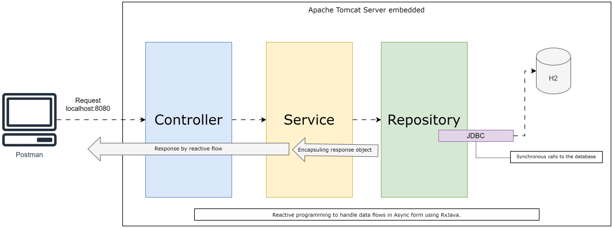

#  CRUD service using RXJava3 And H2

<!-- TOC -->
* [CRUD service using RXJava3 And H2](#crud-service-using-rxjava3-and-h2)
  * [Description](#description)
  * [Diagram](#diagram)
  * [Postman Collection](#postman-collection)
  * [Dependencies](#dependencies)
  * [Package](#package)
<!-- TOC -->

## Description

CRUD Project with RXJava3 managing reactive flows. Database was created using H2.
The connection with database was made using JDBC, library provided by starter-data-jpa.
In that sense the reactive flow is not complete point to point, because calls to database are synchronous.

Extra: Using Exception Handler using @ControllerAdvice and @ExceptionHandler

* Language: Java 17 
* Framework: SpringBoot 3
* Dependency management: Maven 3.6.3

   

## Diagram

## Postman Collection

Click the link below to download the Postman collection:

[Download Postman Collection](docs/crud-service-rxjava.postman_collection.json)

1. Download the file from the link above.
2. Open Postman.
3. Click "Import" in the top left corner.
4. Select the downloaded `crud-service-rxjava-h2.postman_collection.json` file.
5. You can now test the API endpoints using the provided examples.

## Dependencies

- spring-boot-starter-web
- lombok
- RxJava3
- spring-boot-starter-data-jpa
- h2

## Package

- controllers: Used to define endpoints.
- service: Used to process logic bussines.
- repository: Used to connect with relational databases .
- proxy.client: Implements Classes to connect with other REST Services.
- config: Used to configure the project behaviour. 
- model: Used to create simples object like POJOs, DTOs.
